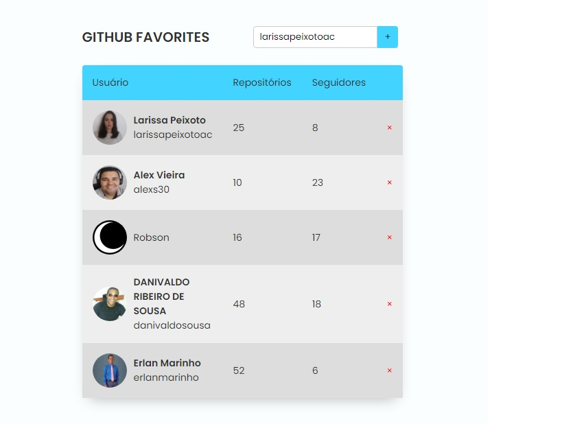

<h1 align="center"> Github Favorites 0.1</h1>

<p align="center">
Desafio avançado do explorer 10  <br/>
<a href="https://www.rocketseat.com.br/explorer">Connheça o Explorer.</a>
</p>

<p align="center">
  <a href="#-tecnologias">Tecnologias</a>&nbsp;&nbsp;&nbsp;|&nbsp;&nbsp;&nbsp;
  <a href="#-projeto">Projeto</a>&nbsp;&nbsp;&nbsp;|&nbsp;&nbsp;&nbsp;
  <a href="#-layout">Layout</a>&nbsp;&nbsp;&nbsp;|&nbsp;&nbsp;&nbsp;
  <a href="#memo-licença">Licença</a>
</p>

<p align="center">
  
</p>

<br>

<p align="center">
  
</p>

## 🚀 Tecnologias

Esse projeto foi desenvolvido com as seguintes tecnologias:

- HTML
- CSS
- JavaScript
- Git e Github

## 💻 Projeto
  Github Favorites é uma aplicação desenvolvida no explorer 10 da Rocketseat, trabalhamos com classes no JavaScript, a aplicação busca os dados do usuário do Github utilizando a API publica do Github e retorna com o nome do usuário, quantidade de repositórios e quantidade de seguidores, salvando assim as informações no localStorage.

- [Acesse o projeto finalizado, online](https://erlanmarinho.github.io/github-favorites/)

## Instalação
Você precisará do [Node.js](https://nodejs.org) instalado no seu computador para criar este aplicativo.

```bash
1º git clone git@github.com:erlanmarinho/explorerSPA-Universe.git

2º npm install

3º npm start
```


##  Licença

Esse projeto está sob a licença MIT.

---

Feito com ♥ by Rocketseat :wave: [Participe da nossa comunidade!](https://discord.gg/rocketseat)
